📚 LiterAlura – Catálogo de Libros
---

**LiterAlura** es una aplicación de consola que te permite explorar y gestionar un catálogo de libros de forma interactiva.
A través de una API de libros, la app obtiene información actualizada en formato **JSON**,
la guarda en una **base de datos** y ofrece diversas opciones para filtrar y mostrar libros y autores de interés.

El usuario cuenta con **5 opciones de interacción**, lo que le permite realizar búsquedas,
consultar detalles y descubrir nuevos títulos de forma sencilla desde la terminal.

## 🔹 Opciones disponibles

1. **Buscar Libro por título:**
   Permite introducir el nombre o parte del título de un libro para buscarlo en la API.
   Si el libro existe en la API, se mostrará su información y se guardará en la base de datos.

2. **Listar Libros registrados:**
   Muestra todos los libros que han sido almacenados en la base de datos durante las búsquedas anteriores.

3. **Listar Autores registrados:**
   Presenta un listado de todos los autores de los libros que se han registrado en la base de datos.

4. **Listar Autores vivos en un determinado año:**
   Permite introducir un año específico para ver qué autores estaban vivos en ese momento, 
   según los datos obtenidos de la API.

5. **Listar Libros por Idioma:**
   Filtra y muestra los libros registrados en la base de datos según el idioma seleccionado (por ejemplo: Español, Inglés)

---

## 🧰 Tecnologías / Herramientas

- 💻 Lenguaje: Java 
- 📚 Librerías/Frameworks: Spring Framework
- 🗄️ Base de datos: PostgreSQL
- 💡 Otros: Jackson Databind, Spring JPA
- 🌐 API : https://gutendex.com/

---

## 🚀 Instalación

1. Clona el repositorio:

   ```bash
   https://github.com/ju-avaria/desafio-literalura.git
   ```

2. El repositorio en el archivo **pom.xml** tiene las siguientes **dependencias**:
   **Jackson Databind** para manipular los archivos **JSON**.
   **Driver PostgreSQL** para poder acceder a la base de datos.
3. Para poder crear una base de datos necesitas tener instalado **PostgreSQL** en tu computadora,
   y en el archivo **application.porperties** debes modificar el **Usuario** y la **Contraseña**,
   para así crear tu propio catálogo de libros.
4. La **API** de **Gutendex** no necesita una **API KEY**, para obtener mas informacion sobre la **API**
   ingresa en el siguiente enlace:  https://gutendex.com/

✅✅ LISTO ,APLICACIÓN LISTA PARA USAR ✅✅

---

## 💻 Uso de la aplicación:

1. Abre el proyecto en un tu IDE de preferencia y ejecuta el archivo **LiteraluraApplication.java**
   Al ejecutar podrás ver la siguente pantalla:

   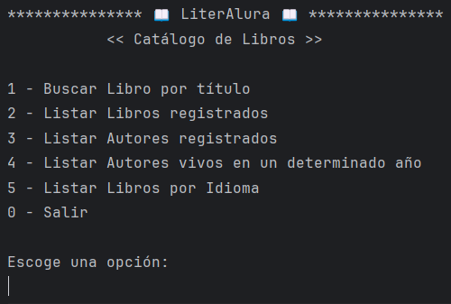
2. Al seleccionar la opción 1️⃣, para luego ingresar un título o parte de este para ser buscado en la API
   y luego los datos del libro serán guardados en la base de datos.

   

   Luego de enviar el título, recibirás los datos del libro buscado y estos ya estarán guardados en tu Catálogo.

   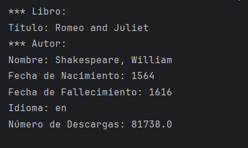
3. Si seleccionas la opción 2️⃣:

   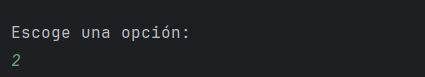

   La aplicación mostrará un listado con todos los libros almacenados en tu catálogo/base de datos.

   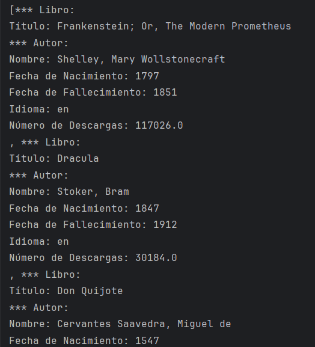

4. Si seleccionas la opción 3️⃣:

   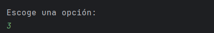

   La aplicación mostrará un listado con todos los autores que se registran en el catálogo.

   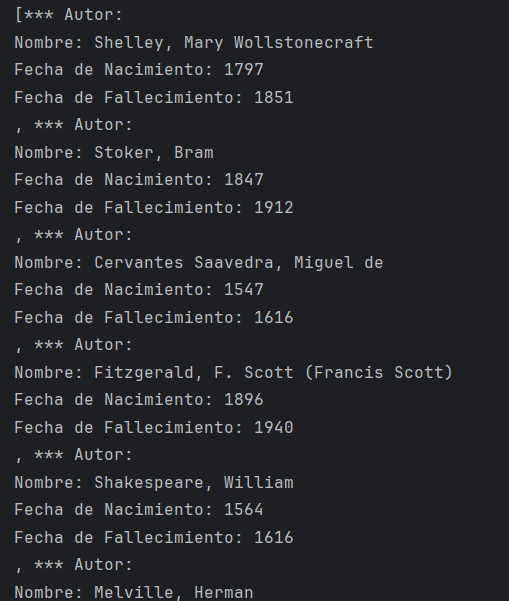

5. Si seleccionas la opción 4️⃣, deberás ingresar un año para asi listar por autores vivos en ese año.

   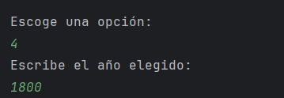

   La aplicación mostrará un listado con todos los autores que estaban vivo en el año ingresado.

   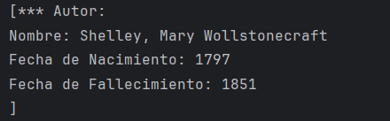
6. Si seleccionas la opción 5️⃣, deberas ingresar un idioma (español o ingles en esta versión)

   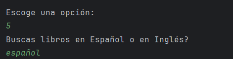

   La aplicación mostrará un listado con todos lo libros guardado que esten el el idioma escogido.

   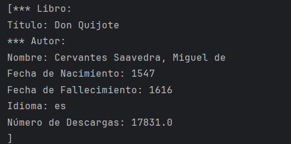
7. Si seleccionas la opción 0️⃣, saldrás de la aplicación y se mostrará lo siguente.

   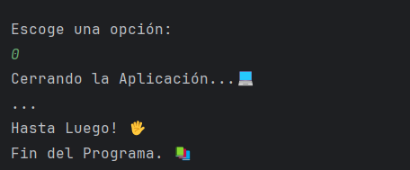

---

**Autor:** https://github.com/ju-avaria


